# ¡Hola, bienvenido a mi portfolio! 👋  
 

### Aquí puedes ver todos mis proyectos en [Github](https://github.com/Hectorcidps/Portfolio_DA)
### Aquí puedes ver todos mis proyectos de [Power BI](https://sites.google.com/view/portfolio-hector-cid/home)

 
<h2> Perfil profesional </h2>

 
Analista de datos, con experiencia en Análisis Exploratorio de Datos (EDA) y comprensión de los procesos de negocio. Manejo herramientas como Excel, Python, SQL y Power BI, con enfoque en la manipulación, limpieza y visualización de datos, además de la creación de informes con métricas relevantes. Me destaco por mi capacidad de aprendizaje rápido y por colaborar eficazmente en equipos. Estoy motivado por aplicar mis habilidades, contribuyendo al análisis y presentación de datos para respaldar decisiones estratégicas.

 
<h2> Mi Stack Tecnológico </h2> 

    
    
    
    
    

 

# Proyectos relevantes
 

## 📊 Optimizar gastos de Marketing en Showz [(Enlace proyecto completo)](https://github.com/Hectorcidps/Portfolio_DA/tree/master/Proyecto%206%20-%20Optimizar%20los%20gastos%20de%20Marketing) 

El departamento de analítica de Showz, una empresa de venta de entradas para eventos, solicitó ayuda para optimizar sus gastos de marketing.

El proyecto se desarrolló en tres fases:

### 1. Preprocesamiento de datos: Limpieza y preparación.

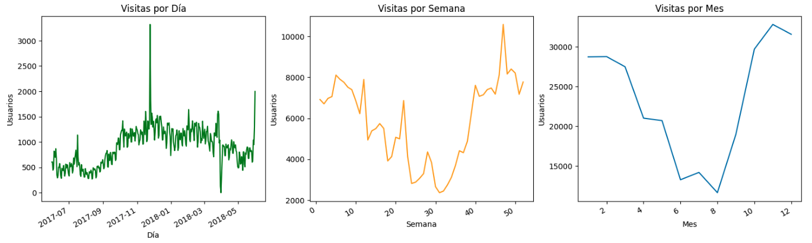

### 2. Análisis y métricas clave: Evaluación de conversión, retención, LTV, CAC y ROMI.

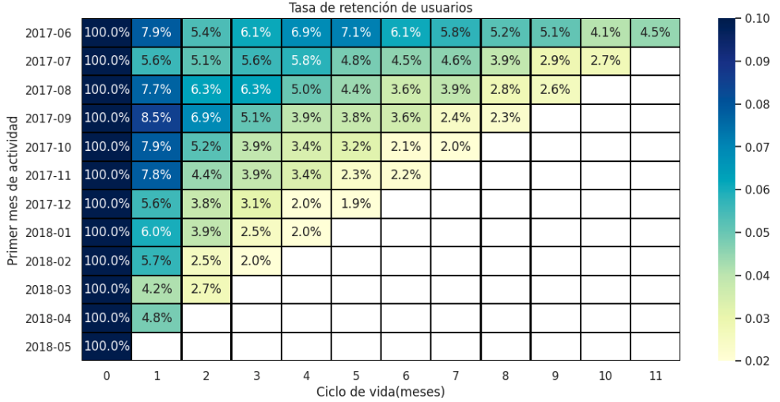

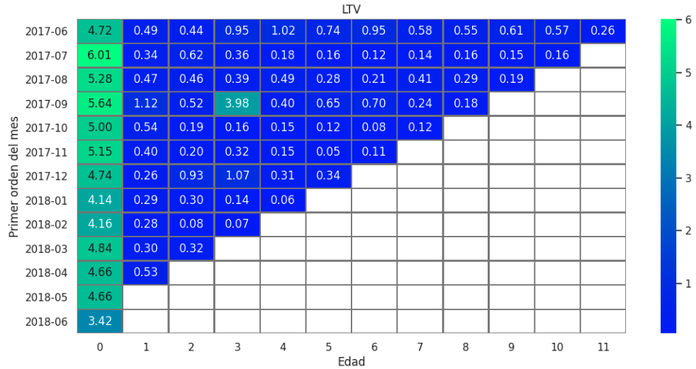

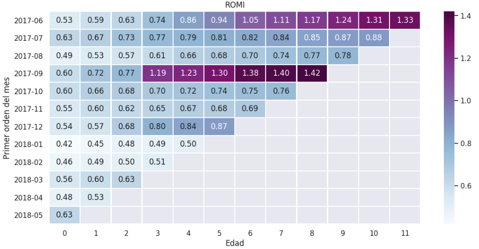

### 3. 📌 Hallazgos clave:
- ✅ Canal 9 resultó ser el más eficiente, con alta retención y el menor costo de adquisición

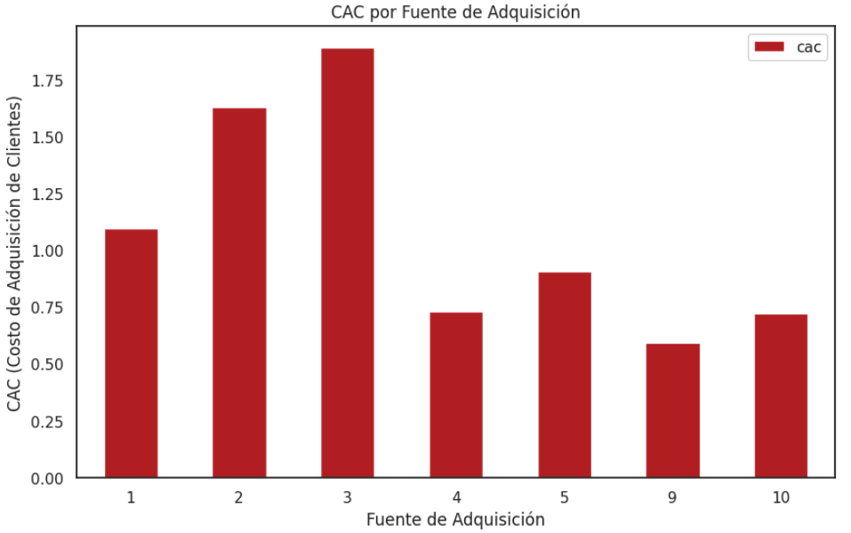

- ⚠️ Canal 3 presentó una conversión menor al 20%, altos costos y el peor rendimiento.

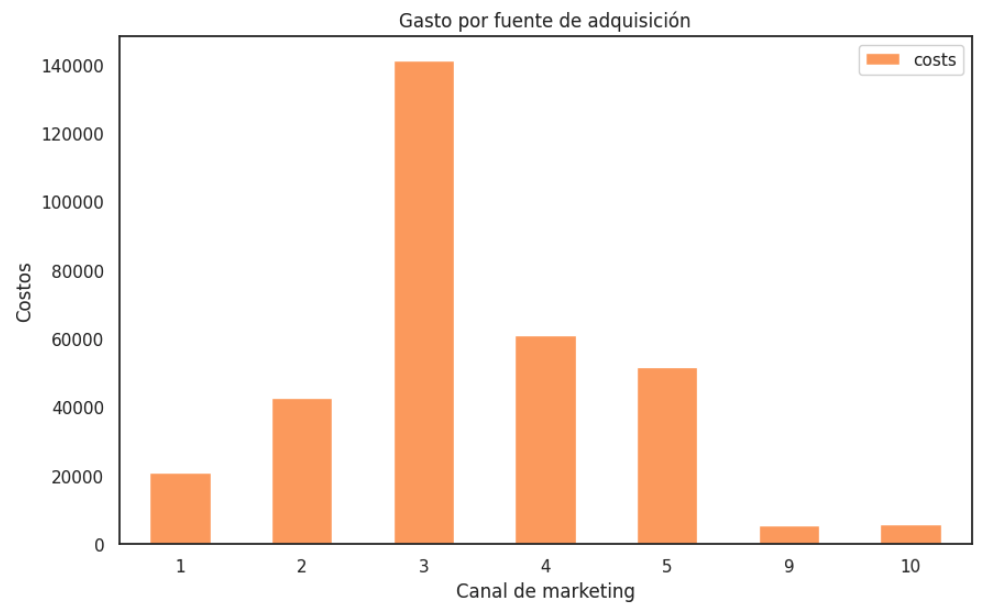

<h4>💡 Se recomienda redistribuir el presupuesto hacia canales más rentables y reducir la inversión en aquellos con pérdidas.</h4>
<h4 style="text-align: justify;"> 
Los resultados muestran que, a pesar del alto tráfico y conversión en algunos canales, la empresa sigue enfrentando pérdidas debido a una asignación ineficiente del presupuesto de marketing.
</h4>
 

## 💲 Ingresos totales Contoso Store [(Enlace al dashboard)](https://sites.google.com/view/portfolio-hector-cid/proyectos/contoso-store)

<h3 style="text-align: justify;"> 
1. Este dashboard en Power BI permite visualizar y comparar los ingresos de la tienda "Contoso" que vende productos tecnológicos (celulares, computadoras, cámaras, audio, entre otros) en diferentes continentes. Se presenta un análisis de ingresos anuales de 2007 a 2009, destacando tendencias y variaciones. Además, incluye dos secciones adicionales:
</h3>
* Ingresos mensuales por tienda, para evaluar el rendimiento individual de cada sucursal.

* Comparación de ingresos mensuales entre años, que facilita la identificación de patrones estacionales y crecimiento en el tiempo.

  

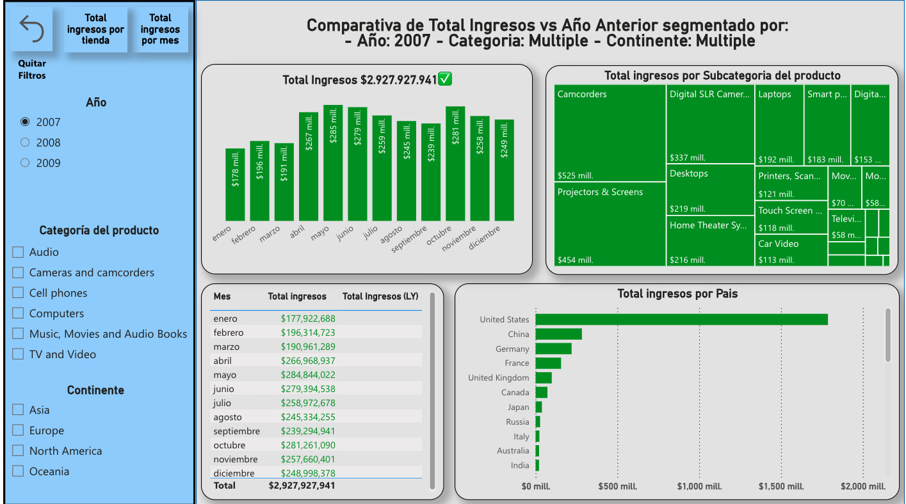 

  

<h3 style="text-align: justify;"> 
2. 💡 Para la limpieza y transformación utilicé Power Query, para cálculos dinámicos y métricas clave utilicé medidas DAX y Tooltips personalizados para mejorar la experiencia interactiva. Finalmente en el modelado de datos transformé un esquema de copo de nieve a un modelo de estrella con la finalidad de mejorar la eficiencia en la carga y el procesamiento de datos.
</h3>
  

 

  

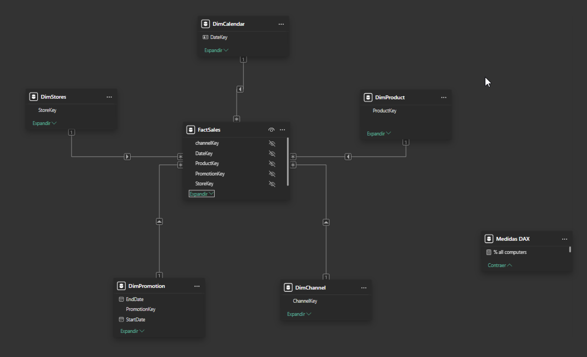  

## 🚀📈 Resultados: 

### 📊 Comparativa de ingresos por año, categoría y continente

📆 2007
* 💰 Ingresos totales: $2.92B
* 📈 Picos de ingresos: Abril - Julio y Octubre

🏆 Top 3 categorías más vendidas:
- 1️⃣ Camcorders – $525M
- 2️⃣ Projectors and Screens – $454M
- 3️⃣ Digital SLR Cameras – $337M

* 🌍 Top 3 países con mayores ingresos:
* 🇺🇸 EE.UU. – $1.8B
* 🇨🇳 China y 🇩🇪 Alemania – Menos de $283M

📆 2008
* 📉 Caída en ingresos, aunque algunas categorías mantuvieron liderazgo.
* 📌 Camcorders y Projectors and Screens siguen en el Top 3, pero con ventas menores.
* 💻 Laptops aumentó ingresos en comparación con 2007.

📆 2009
- 💻 Laptops se convirtió en la categoría más vendida, superando a las anteriores líderes.

  

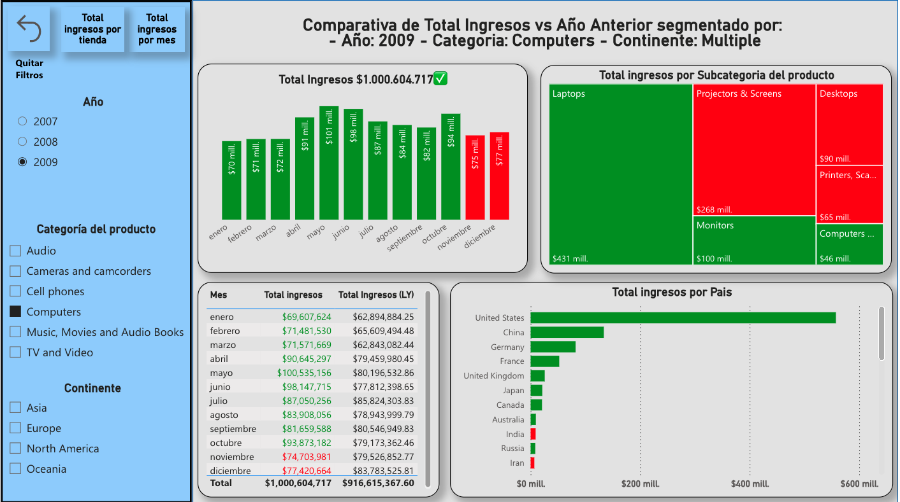  

### 🏪 Top 3 Tiendas con Mayores Ingresos por Año

📆 2007
* 1️⃣ Contoso Catalog Store – $252.6M
* 2️⃣ Contoso North America Online Store – $176.8M
* 3️⃣ Contoso Europe Online Store – $155.1M

📆 2008
- 1️⃣ Contoso Catalog Store – $197.8M
- 2️⃣ Contoso North America Online Store – $194.7M
- 3️⃣ Contoso Asia Online Store – $172.1M

📆 2009
* 1️⃣ Contoso North America Online Store – $202M
* 2️⃣ Contoso Catalog Store – $197M
* 3️⃣ Contoso Asia Online Store – $195M

  

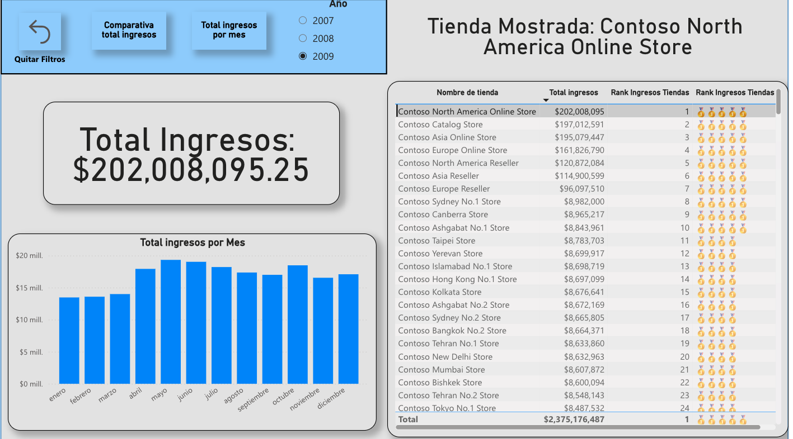  

### 📆 Análisis de Ingresos Mensuales
- 🔹 2007: $2.92B, con los meses más rentables en abril, mayo, junio, julio y octubre.
- 🔹 2008: Caída a $2.44B (-$478M respecto a 2007). Las mayores pérdidas ocurrieron en mayo, junio y octubre.
- 🔹 2009: Nueva caída a $2.37B (-$74M respecto a 2008). Sin embargo, hubo repunte en mayo, junio y octubre.

  

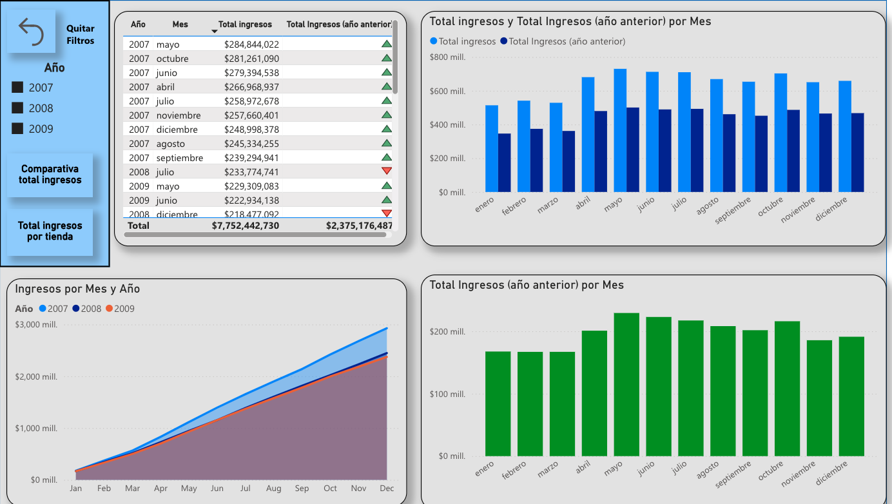  

 

##  💪 Optimización de la Retención en Gimnasio Model Fitness [(Enlace proyecto completo)](https://github.com/Hectorcidps/Portfolio_DA/tree/master/Proyecto%2010%20-%20Cadena%20de%20gimnasios%20Model%20Fitness)

<h3 style="text-align: justify;"> 
1. Se analizó el comportamiento de los clientes de Model Fitness para diseñar estrategias que reduzcan la pérdida de usuarios. 
</h3>

* Se utilizaron modelos de regresión logística, Random Forest y clustering, con el objetivo de identificar patrones de uso y clientes en riesgo de cancelar su suscripción.

 
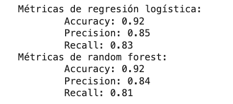

### 2. 🔎 Hallazgos clave
* 📊 Se identificaron cinco grupos de clientes con diferentes tasas de cancelación.
* ✅ Clientes leales (Clusters 3 y 1): Baja tasa de cancelación (3.9% y 9.2%).
* 🚨 Clientes en riesgo (Clusters 0 y 2): Cancelaciones moderadas (27.4% y 30.2%).
* ⚠️ Clientes críticos (Cluster 4): Alta tasa de cancelación (50.3%).

 

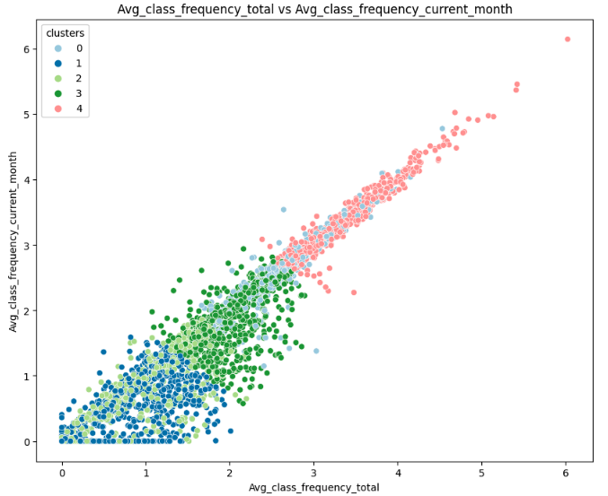

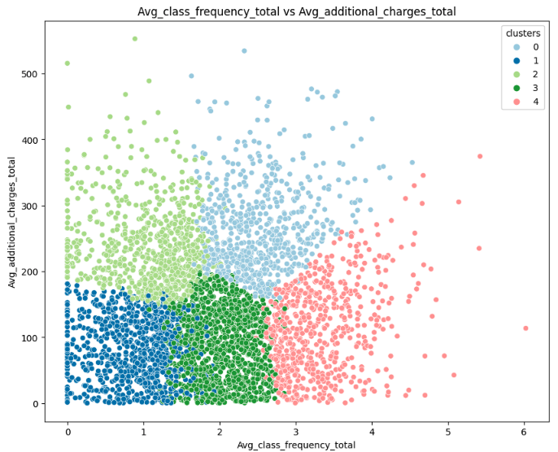

### 3. 🎯 Estrategias por grupo
* Clientes leales: Programas de recompensas, descuentos y referidos.
*  Clientes en riesgo: Encuestas de satisfacción, promociones dirigidas y comunicación personalizada.
*  Clientes críticos: Descuentos significativos, pausas de membresía o reembolsos parciales.

### 4. 📈 Conclusión

* Las estrategias personalizadas según cada cluster pueden mejorar la retención y optimizar los esfuerzos de marketing, enfocándose en mantener clientes leales e interviniendo oportunamente en los segmentos con mayor riesgo de abandono.

 

## 📱 Telecomunicaciones: Identificar operadores ineficaces [(Enlace proyecto completo)](https://github.com/Hectorcidps/Portfolio_DA/tree/master/Proyecto%20final/Proyecto%20Telecomunicaciones)

### 1. 🔍 Objetivo

CallMeMaybe busca identificar a los operadores menos eficaces mediante el análisis de llamadas entrantes y salientes, tiempos de espera y llamadas perdidas. Se definieron operadores ineficaces como aquellos con altos tiempos de espera, muchas llamadas entrantes perdidas y pocas llamadas salientes (cuando aplicaba).

### Se implementaron las siguientes acciones:

### 📊 Análisis exploratorio de datos, detectando valores ausentes, duplicados y atípicos.

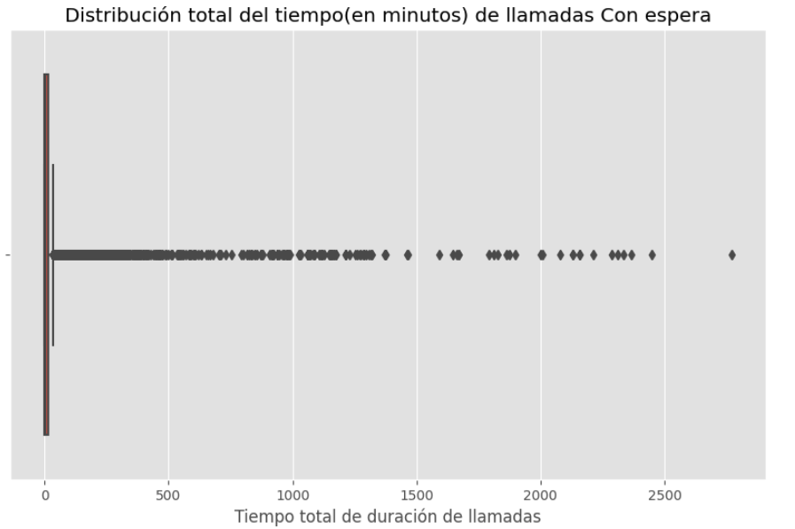

* Enriquecimiento de datos con segmentación por meses, semanas y días.
* Cálculo del número de llamadas entrantes y salientes por operador.
* Desarrollo de un índice de ineficacia basado en llamadas perdidas, tiempo de espera y volumen de llamadas salientes.
* Identificación de operadores ineficaces por tipo de plan.
* Pruebas de hipótesis para evaluar diferencias entre operadores eficientes e ineficientes.

### 2. 🔎 Hallazgos Clave

* Se encontraron 4900 valores duplicados, pero se decidieron conservar al ser relevantes.
* Se identificaron 8289 valores ausentes en operator_id, vinculados a llamadas perdidas o salientes sin operador asignado.

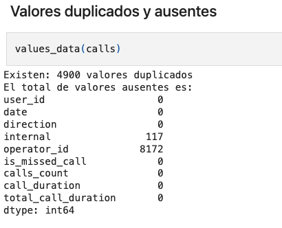

* Las llamadas salientes predominaban sobre las entrantes.

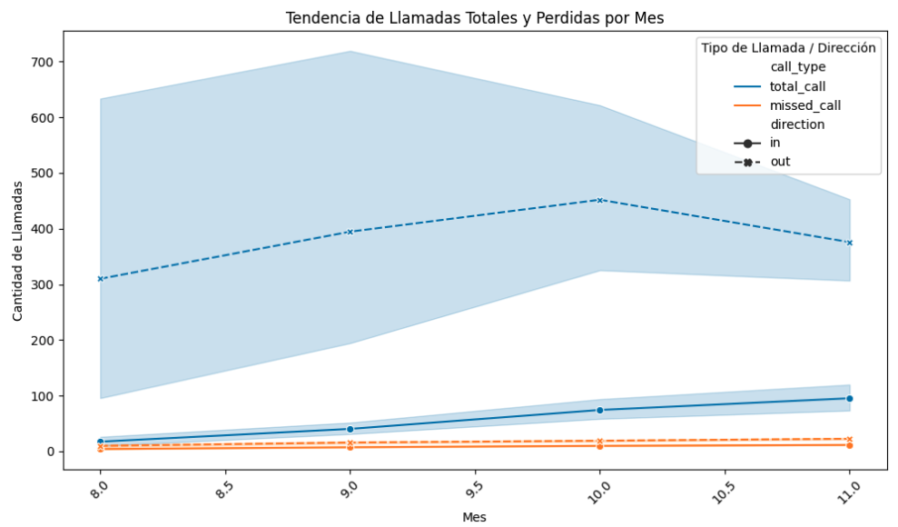

* Entre las semanas 40 y 45, se observó un pico de actividad operativa.

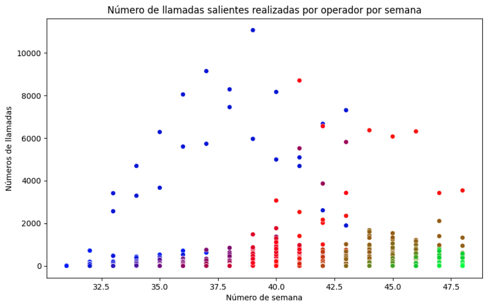

* Se segmentaron operadores en tres grupos según su índice de ineficacia:
* Grupo A (menos eficiente): 31% de ineficacia, 457 minutos de espera.
* Grupo C (más eficiente): 20% de ineficacia, 137 minutos de espera.

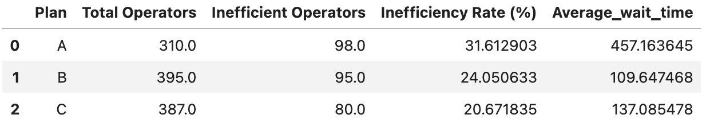

### 3. El operador con mayor ineficiencia registró:

- 2% de llamadas perdidas
- 17 minutos de espera en promedio
- Bajo volumen de llamadas salientes

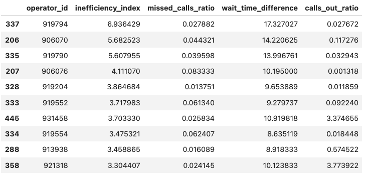

### 4. 🌐 Pruebas Estadísticas

* La prueba de Kruskal-Wallis indicó diferencias significativas en los tiempos de espera entre grupos.
* La prueba U de Mann-Whitney confirmó diferencias significativas entre operadores eficaces e ineficaces en términos de tiempo de espera y llamadas perdidas.
* La distribución de llamadas perdidas resultó no normal, validada con pruebas adicionales.

### 5. 🌟 Conclusión

El análisis permitió identificar a los operadores con menor desempeño y establecer criterios objetivos para evaluar la eficiencia operativa. Se recomienda implementar estrategias específicas para reducir tiempos de espera y mejorar la gestión de llamadas entrantes y salientes.

### Si quieres conocer más sobre mi trabajo en análisis de datos te invito a visitar mi portafolio completo en [GitHub](https://github.com/Hectorcidps/Portfolio_DA/tree/master)

### Si quieres conocer más sobre mi trabajo con [Power BI](https://sites.google.com/view/portfolio-hector-cid/home) te invito a revisar mi portafolio. 

